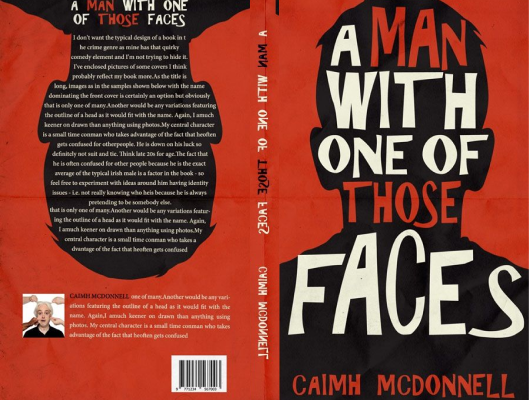

# A Man With One Of Those Faces

Author: Caimh McDonnell

Tags: Literature, Fiction

Released Year: 2016

ISBN: 978-0995507500

## Synopsis

The first time somebody tried to kill him was an accident.
The second time was deliberate.
Now Paul Mulchrone finds himself on the run with nobody to turn to except a nurse who has read one-too-many crime novels and a renegade copper with a penchant for violence. Together they must solve one of the most notorious crimes in Irish history...

## Cover
