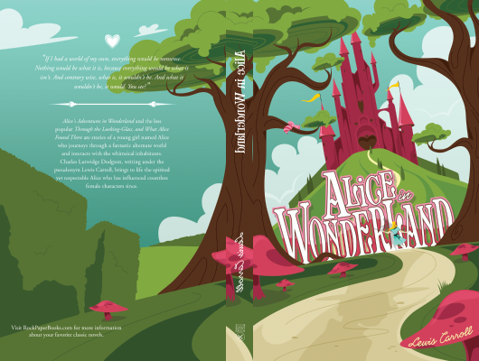

# Alice In Wonderland

Author: Lewis Carroll

Tags: adventure, family, fantasy

Released Year: 1865

ISBN: 978-0393932348

## Synopsis

Alice's Adventures in Wonderland (commonly shortened to Alice in Wonderland) is an 1865 novel written by English author Charles Lutwidge Dodgson under the pseudonym Lewis Carroll.It tells of a young girl named Alice falling through a rabbit hole into a fantasy world populated by peculiar, anthropomorphic creatures. The tale plays with logic, giving the story lasting popularity with adults as well as with children.It is considered to be one of the best examples of the literary nonsense genre.

## Cover

