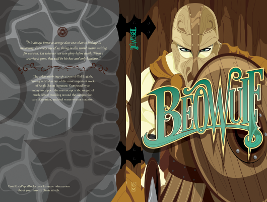

# Beowulf

Author: Burton Raffel

Tags: Action, Adventure, Fantasy

Released Year: 1988

ISBN: 978-0451530967

## Synopsis

The warrior Beowulf must fight and defeat the monster Grendel, who is terrorizing Denmark, then Grendel's Mother, who begins killing out of revenge.

## Cover

