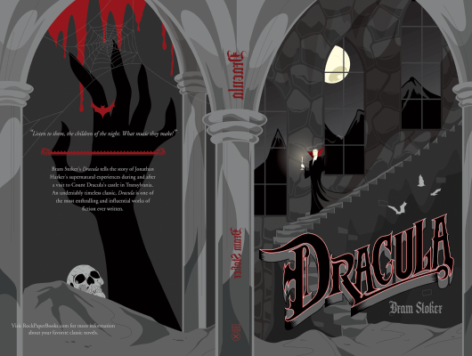

# Dracula

Author: Bram Stoker

Tags: Horror, Gothic

Released Year: 1897

ISBN: 978-0-525-95129-2

## Synopsis

Dracula is one of the most famous pieces of English literature. Many of the book's characters have entered popular culture as archetypal versions of their characters; for example, Count Dracula as the quintessential vampire, and Abraham Van Helsing as an iconic vampire hunter. The novel, which is in the public domain, has been adapted for film over 30 times, and its characters have made over a thousand appearances in virtually all forms of media.

## Cover

