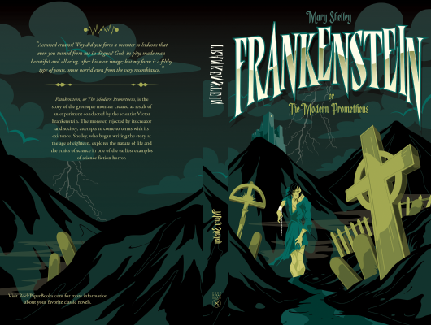

# Frankenstein

Author: Mary Shelley

Tags: Drame, Horror, Fiction

Released Year: 1818

ISBN: 978-0486282114

## Synopsis

Few creatures of horror have seized readers' imaginations and held them for so long as the anguished monster of Mary Shelley's Frankenstein. The story of Victor Frankenstein's terrible creation and the havoc it caused has enthralled generations of readers and inspired countless writers of horror and suspense. Considering the novel's enduring success, it is remarkable that it began merely as a whim of Lord Byron's.

## Cover

