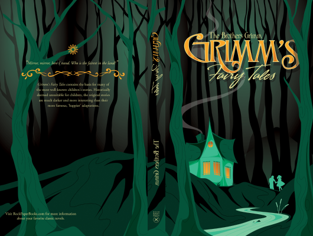

# Grimms Fairy Tales

Author: Brothers Grimm

Tags: Folklore, Children

Released Year: 1976

ISBN: 978-0394709307

## Synopsis

From the land of fantastical castles, vast lakes and deep forests, the Brothers Grimm collected a treasury of enchanting folk and fairy stories full of giants and dwarfs, witches and princesses, magical beasts and cunning children. From classics such as 'The Frog-Prince' and 'Hansel and Grettel' to the delights of 'Ashputtel' or 'Old Sultan', all hold a timeless magic which has enthralled children for centuries.

## Cover

