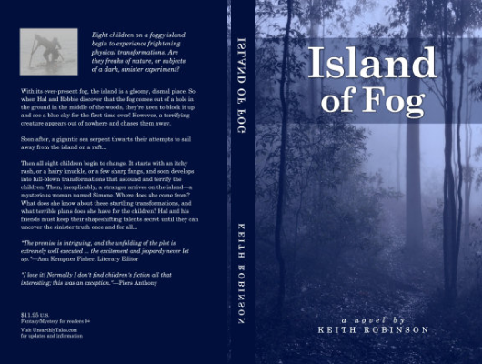

# Island Of Fog

Author: Keith Robinson

Tags: Horrer, Mystery

Released Year: 1995

ISBN: 978-0984390601

## Synopsis

A foggy island is home to eight children. They've never seen the world beyond the fog, never seen a blue sky or felt the warmth of the sun on their skin. And now they're starting to change into monsters! What is the secret behind the mysterious fog? Who is the stranger that shows up one morning, and where did she come from? The children are determined to uncover the truth, and their quest takes them to the forbidden lighthouse...

## Cover

