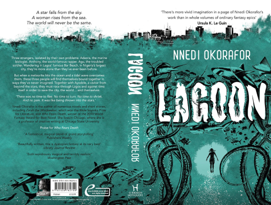

# Lagoon

Author: Nnedi Okorafor

Tags: Thriller, Adventure, Fiction, Fantasy

Released Year: 2014

ISBN: 978-1481440882

## Synopsis

Three strangers, each isolated by his or her own problems: Adaora, the marine biologist. Anthony, the rapper famous throughout Africa. Agu, the troubled soldier. Wandering Bar Beach in Lagos, Nigeria's legendary mega-city, they're more alone than they've ever been before.

But when something like a meteorite plunges into the ocean and a tidal wave overcomes them, these three people will find themselves bound together in ways they could never imagine. Together with Ayodele, a visitor from beyond the stars, they must race through Lagos and against time itself in order to save the city, the world... and themselves.

'There was no time to flee. No time to turn. No time to shriek. And there was no pain. It was like being thrown into the stars.'

## Cover

