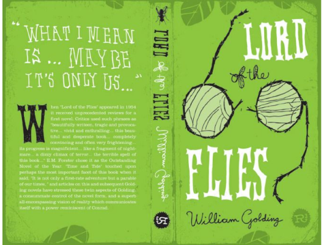

# Lord Of The Flies

Author: William Golding

Tags: Fiction, Classic, Thriller, Adventure

Released Year: 1954

ISBN: 9780399501487

## Synopsis

A plane crashes on a desert island. The only survivors are a group of schoolboys. By day, they discover fantastic wildlife and dazzling beaches, learning to survive; at night, they are haunted by nightmares of a primitive beast. Orphaned by society, it isn't long before their innocent childhood games devolve into a savage, murderous hunt ...

## Cover

