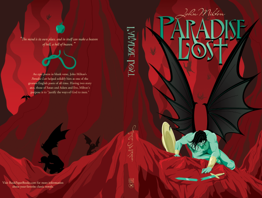

# Paradise Lost

Author: John Milton

Tags: Poetry, Classic, Fiction

Released Year: 1667

ISBN: 9780199535743

## Synopsis

From almost the moment of its first publication in 1667, Paradise Lost was considered a classic. It is difficult now to appreciate both how audacious an undertaking it represents, and how astonishing its immediate and continued success was. Over the course of twelve books Milton wrote an epic poem that would 'justify the ways of God to men', a mission that required a complex drama whose source is both historical and deeply personal. The struggle for ascendancy between God and Satan
is played out across hell, heaven, and earth but the consequences of the Fall are all too humanly tragic - pride, ambition, and aspiration the motivating forces. In this new edition derived from their acclaimed Oxford Authors text, Stephen Orgel and Jonathan Goldberg discuss the complexity of Milton's poem

## Cover

