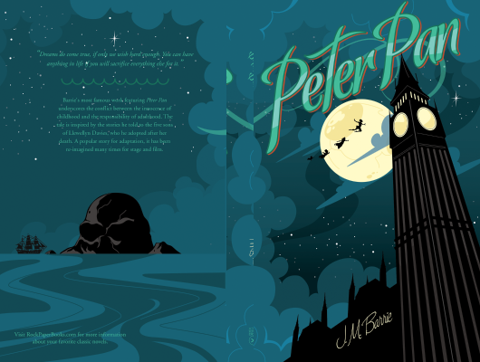

# Peter Pan

Author: James Matthew Barrie

Tags: Children, Fiction, Fantasy

Released Year: 1911

ISBN: 9780147508652

## Synopsis

One starry night, Peter Pan and Tinker Bell lead the three Darling children over the rooftops of London and away to Neverland - the island where lost boys play, mermaids splash and fairies make mischief. But a villainous-looking gang of pirates lurk in the docks, led by the terrifying Captain James Hook. Magic and excitement are in the air, but if Captain Hook has his way, before long, someone will be walking the plank and swimming with the crocodiles...

## Cover

