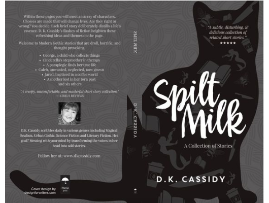

# Split Milk

Author: DK Cassidy

Tags: Children, Folklore, Short

Released Year: 2011

ISBN: 9781941938003

## Synopsis

Within these pages you will meet an array of characters. Choices are made that will change lives. Are they right or wrong? You decide. Each brief story deliberately distills a life's essence. Mika Sugano's original illustrations compliment D. K. Cassidy's flashes of fiction, heightening these refreshing ideas and themes on the page. Welcome to urban Gothic stories that are droll, horrific, and thought provoking. - George, a child who collects things - Cinderella's stepmother in therapy - A paraplegic finds her true life - Caleb, unwanted, neglected, now grown - Jared, baptized in a coffee world - A mother lost in her torn past - And six others

## Cover

