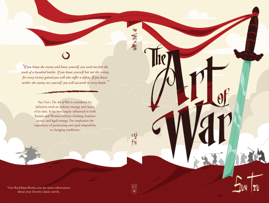

# The Art Of War

Author: Sun Tzu

Tags: Military, Career, Succes

Released Year: 2017

ISBN: 9781590302255

## Synopsis

Conflict is an inevitable part of life, according to this ancient Chinese classic of strategy, but everything necessary to deal with conflict wisely, honorably, victoriously, is already present within us. Compiled more than two thousand years ago by a mysterious warrior-philosopher, The Art of War is still perhaps the most prestigious and influential book of strategy in the world, as eagerly studied in Asia by modern politicians and executives as it has been by military leaders since ancient times. As a study of the anatomy of organizations in conflict, The Art of War applies to competition and conflict in general, on every level from the interpersonal to the international. Its aim is invincibility, victory without battle, and unassailable strength through understanding the physics, politics, and psychology of conflict.

## Cover

