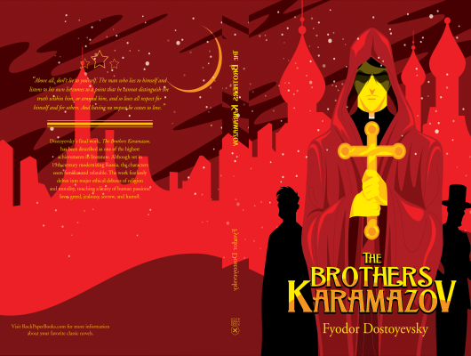

# The Brothers Karamazov

Author: Fyodor Dostoyevsky

Tags: FIction, Classic, Crime

Released Year: 1997

ISBN: 9781840221862

## Synopsis

The murder of brutal landowner Fyodor Karamazov changes the lives of his sons irrevocably: Mitya, the sensualist, whose bitter rivalry with his father immediately places him under suspicion for parricide; Ivan, the intellectual, driven to breakdown; the spiritual Alyosha, who tries to heal the family's rifts; and the shadowy figure of their bastard half-brother, Smerdyakov. Dostoyevsky's dark masterwork evokes a world where the lines between innocence and corruption, good and evil, blur, and everyone's faith in humanity is tested.

## Cover

