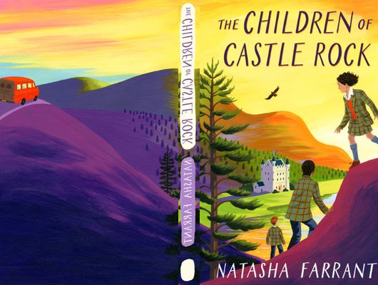

# The Children Of Castle Rock

Author: Natasha Farrant

Tags: Funny, Romance

Released Year: 2002

ISBN: 9780571323562

## Synopsis

When Alice's family home has to be sold, she and her father Barney will do whatever it takes to buy it back - even if whatever it takes isn't strictly legal. And when Alice is expelled and sent away to an isolated boarding-school, she'll do whatever it takes again to get away. But Stormy Loch Academy isn't quite what she expected. With its strange rules and eccentric headmaster and rag-tag mix of students and teachers, it has a way of growing on you. Still, when Barney goes missing (all that not strictly legal business) she knows she has to rescue him. Armed with two new friends, she sets off on an epic quest through the wild Scottish highlands and islands to finally get her heart's desire - but does she know anymore exactly what that is?

## Cover

