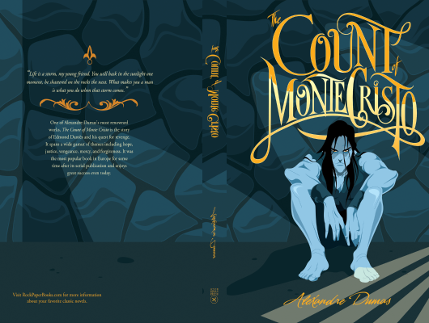

# The Count Monie Cristo

Author: Alexandre Dumas

Tags: Classic, Adventure, Fiction

Released Year: 1844

ISBN: 978-0991440764

## Synopsis

Le Comte de Monte-Cristo, a classic literary tale of revenge, was first published in serial form in Paris, appearing in 18 volumes of the Journal des Débats from 1844-1845. It takes place in France, Italy, and the Mediterranean. The theme of the novel extends beyond revenge to encompass hope, justice, mercy, and forgiveness. As the characters of the story reveal their true selves through their actions over the course of the book, the reader also sees romance, loyalty, betrayal, and selfishness.

The unabridged form of this story runs to over 1,000 pages in either French or English, necessitating multiple volumes of this bilingual edition, which is designed to assist those learning French. The original French text appears on the right-hand pages of the book, with the corresponding English translation on the left-hand pages.

## Cover

