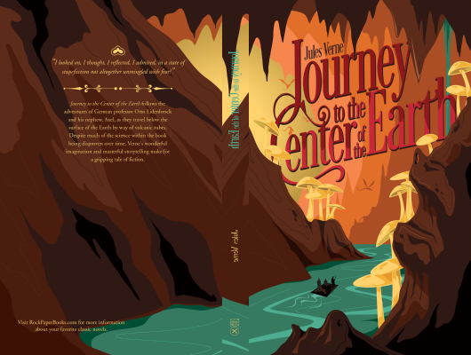

# The Journey To The Center Of The Earth

Author: Jules Verne

Tags: Action, Adventure

Released Year: 2004

ISBN: 978-0486440880

## Synopsis

An adventurous geology professor chances upon a manuscript in which a 16th-century explorer claims to have found a route to the earth's core. Professor Lidenbrock can't resist the opportunity to investigate, and with his nephew Axel, he sets off across Iceland in the company of Hans Bjelke, a native guide. The expedition descends into an extinct volcano toward a sunless sea, where they encounter a subterranean world of luminous rocks, antediluvian forests, and fantastic marine life -- a living past that holds the secrets to the origins of human existence.
Originally published in 1864, Jules Verne's classic remains critically acclaimed for its style and imaginative visions. Verne wrote many fantasy stories that later proved remarkably prescient, and his distinctive combination of realism and romanticism exercised a lasting influence on writers as diverse as Mark Twain, Arthur Conan Doyle, and Jean-Paul Sartre. In addition to the excitement of an action novel, Journey to the Center of the Earth has the added appeal of a psychological quest, in which the sojourn itself is as significant as the ultimate destination.

## Cover

