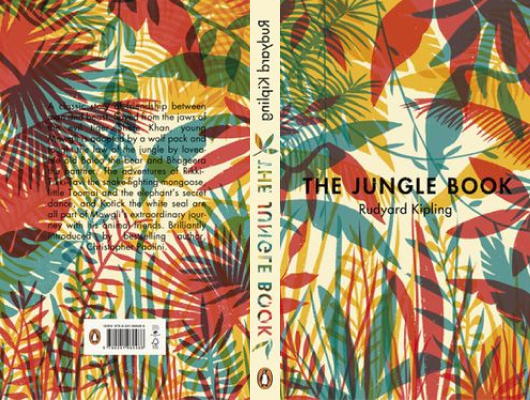

# The Jungle Book

Author: Rudyard Kipling

Tags: Adventure, Children, Classic

Released Year: 1914

ISBN: 9780141325293

## Synopsis

he Jungle Book is a classic story of friendship between man and beast.
Saved from the jaws of the evil tiger Shere Khan, young Mowgli is adopted by a wolf pack and taught the law of the jungle by lovable old Baloo the bear and Bhageera the panther. The adventures of Rikki-Tikki-Tavi the snake-fighting mongoose, little Toomai and the elephant's secret dance, and Kotick the white seal are all part of Mowgli's extraordinary journey with his animal friends.

With an introduction by Christopher Paolini.

Joseph Rudyard Kipling (1865-1936) was born in India, although educated in England. He was a prolific writer and recognized as a genius. In 1907 he was awarded the Nobel Prize for Literature. His many books for children include Just So Stories and Kim.

## Cover

