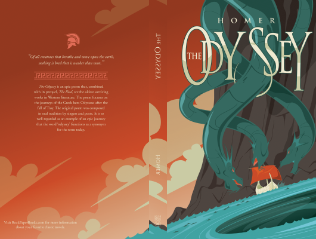

# The Odyssey

Author: Homer

Tags: Classic, Poem

Released Year: 2006

ISBN: 9780143039952

## Synopsis

This is the epic tale of Odysseus and his ten-year journey home after the Trojan War forms one of the earliest and greatest works of Western literature. Confronted by natural and supernatural threats - shipwrecks, battles, monsters and the implacable enmity of the sea-god Poseidon - Odysseus must use his wit and native cunning if he is to reach his homeland safely and overcome the obstacles that, even there, await him.

## Cover

