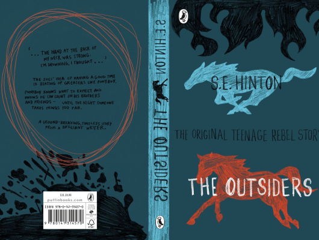

# The Outsiders

Author: Se Hinton

Tags: Fiction, Children, Classic

Released Year: 2007

ISBN: 9780141368887

## Synopsis

The Outsiders is an outstanding story of teenage rebellion, written when the author was only 17.

Teenagers in a small Oklahoma town have split into two gangs, divided by money, tastes and attitude. The Socs' idea of having a good time is beating up Greasers like Ponyboy Curtis.

Ponyboy knows what to expect and knows he can count on his brothers and friends - until the night someone takes things too far, and life is changed forever.

## Cover

