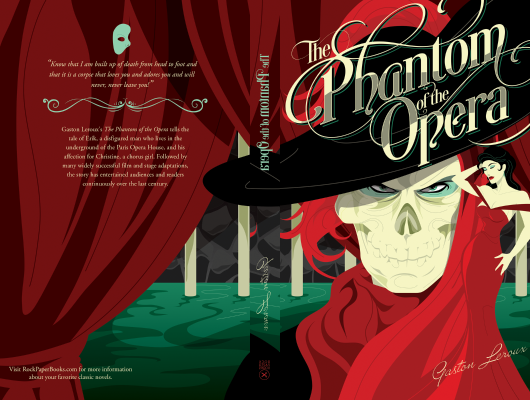

# The Phantom Of The Opera

Author: Gaston Leroux

Tags: Classic, Horrer, Romance

Released Year: 2011

ISBN: 9780007420278

## Synopsis

Living secretly beneath the Paris Opera House, 'The Phantom of the Opera', Erik has haunted those who work there with his demands and shrouded the opera house in fear with the legend of his disfigured face. When Christine joins the company, a young woman with a beautiful voice, Erik is instantly smitten and secretly teaches her to become a great singer. He soon develops an obsessive love for his beautiful protege, even though she has fallen for her childhood friend, resulting in her disappearance during a performance and sparking a tragic and terrifying chain of events.

## Cover

