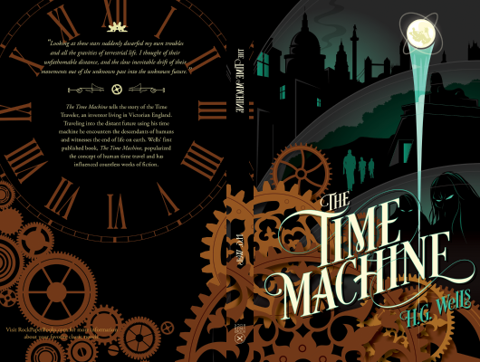

# The Time Machine

Author: Hg Wells

Tags: Fiction, Adventure

Released Year: 2012

ISBN: 9781473217973

## Synopsis

A Victorian scientist develops a time machine and travels to the year 802,171 AD. There he finds the meek, child-like Eloi who live in fear of the underground-dwelling Morlocks. When his time machine goes missing, the Traveller faces a fight to enter the Morlocks' domain and return to his own time.

THE TIME MACHINE remains one of the cornerstones of science-fiction literature and has proved hugely influential.

## Cover

