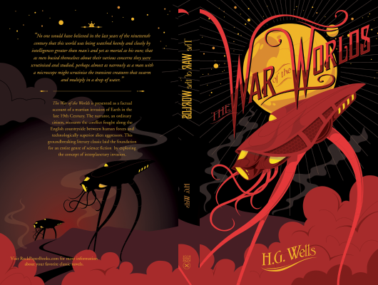

# The War Of The Worlds

Author: Hg Wells

Tags: Fiction, Horrer

Released Year: 2011

ISBN: 9780141199047

## Synopsis

Death!' I shouted. 'Death is coming! Death!'

In this pioneering, shocking and nightmarish tale, naive suburban Londoners investigate a strange cylinder from space, but are instantly incinerated by an all-destroying heat-ray. Soon, gigantic killing machines that chase and feed on human prey are threatening the whole of humanity. A pioneering work of alien invasion fiction, The War of the World's journalistic style contrasts disturbingly with its horrifying visions of the human race under siege.

The Penguin English Library - 100 editions of the best fiction in English, from the eighteenth century and the very first novels to the beginning of the First World War.

## Cover

