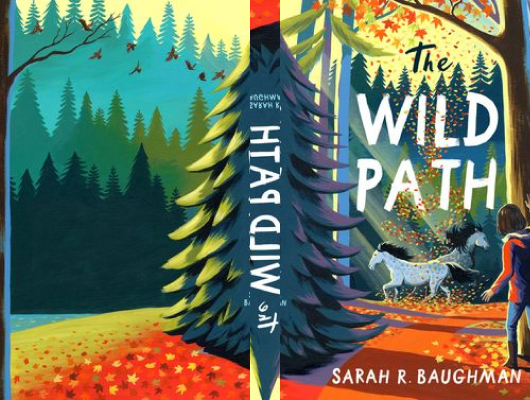

# The Wild Path

Author: Sarah Baughman

Tags: Children, Fantasy, Family

Released Year: 20120

ISBN: 978-0316422475

## Synopsis

Twelve-year-old Claire Barton doesn't like the "flutter feeling" that fills her chest when she talks to new people or worries about the future, but she knows what she loves: the land that's been in her family for three generations; her best friend Maya; her family's draft horses, Sunny and Sam; and her older brother Andy. That's why, with Andy recently sent to rehab after a DUI, and her parents planning to sell the horses, Claire's world feels like it might flutter to pieces.

A possible solution presents itself at school when Claire's teacher assigns the class a presentation: each student must research an historical concept that holds continued relevance. Motivated to overcome her dislike of public speaking, Claire decides to research how horses were used for in the past and how they can still be useful today. When she learns about equine therapy from a helpful neighbor, she begins to dream that starting her own equine therapy business will be enough to allow her parents to keep Sunny and Sam. But in the woods stretching for miles behind her house, Claire senses signs that she's not alone in the quiet stillness, and that a mysterious herd of wild horses might live among the trees, too.

## Cover

