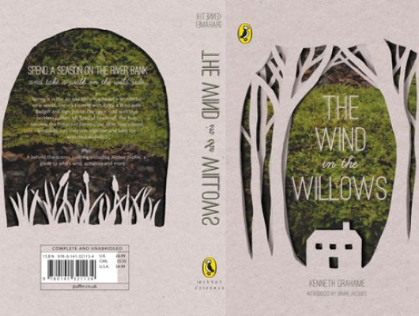

# The Wind In The Willows

Author: Kenneth Grahame

Tags: Children, Animal

Released Year: 2008

ISBN: 9781844566730

## Synopsis

Mole enjoys a quiet life but when spring comes, his longing for adventure takes him to the river. There, he meets Water Rat and his friends Otter, Badger and Toad. With messing about in boats and Toad's love of fast cars, Mole's life is no longer quiet - especially when the friends have to join forces against the animals from the Wild Wood.

## Cover

