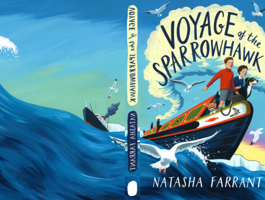

# Voyage Of The Sparrowhawk

Author: Natasha Farrant

Tags: Children, Adventure, Animal

Released Year: 2005

ISBN: 978-0571348763

## Synopsis

In the aftermath of World War One, everyone in the small town of Barton is rebuilding their lives. Ben needs to find his brother, Sam-who was wounded in action and is now missing-if he wants to avoid being sent to the orphanage. Lotti's horrible aunt and uncle want to send her away from her beloved home to boarding school, just when she has successfully managed to get expelled from her last one.

When a chance encounter brings the two children together, each recognizes the other as a kindred spirit. But just as they've found their feet, disaster strikes, and Ben and Lotti must run away. They hatch a plan to cross the English Channel on Ben's narrowboat, the Sparrowhawk, and track down Sam in France. But there's something in France that Lotti is looking for, too. . . .

Funny, heartwarming, and wise, Voyage of the Sparrowhawk is full of high stakes, twists and connections, and-most of all-adventure.

## Cover

